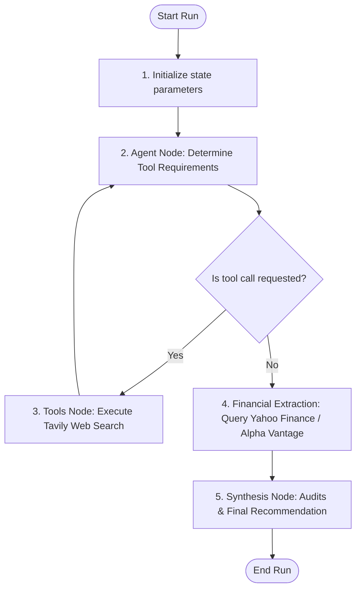

# VALO – AI Investment Research Agent

VALO is an AI-powered Investment Research Agent that helps users analyze publicly listed companies and make informed investment decisions. Users can search for a company using its name or stock ticker, and the application performs real-time research by collecting company information, financial metrics, stock market data, and recent news. Based on this data, the AI generates a detailed analysis, SWOT report, investment score, and an INVEST or PASS recommendation with reasoning.

---

## 🚀 Key Features

*   **Stateful Agentic Workflows**: Multi-node LangGraph execution flow that loops recursively to verify search results.
*   **Real-Time Data Collectors**: Direct integration with `yahoo-finance2` for ticker quotes and Alpha Vantage for historical balance sheets.
*   **Semantic Market Search**: Utilizes Tavily search agents to track press headlines and perform sentiment audits.
*   **Interactive Visualizations**: Beautiful client-side ReCharts dashboard plotting Revenue growth, Profit margins, EPS tracks, and valuation multiples.
*   **TradingView Stock Chart**: Full-featured interactive candlestick chart showing real historical performance with zoom/pan and day metrics.
*   **Vector PDF & JSON Export**: Download raw data payloads as JSON or print vector-drawn reports.
*   **Streamed Execution Logs**: Progress indicators and animated steppers connected to a Server-Sent Events (SSE) stream.
*   **Robust Off-Line Fallbacks**: Graceful mockup overrides that let the app run without API keys.

---

## 🛠 Tech Stack

- **Framework**: Next.js 14 (App Router)
- **Frontend Logic**: React 18, TypeScript, Tailwind CSS v3
- **Agent Logic**: LangGraph.js, LangChain.js
- **Models**: Gemini 1.5 Flash (default) or GPT-4o-mini
- **Data Providers**: Tavily Search REST API, Yahoo Finance APIs, Alpha Vantage Services
- **PDF Exporter**: jsPDF (Vector-Text printing engine)
- **Visualizations**: Recharts / TradingView Lightweight Charts

---

## 📐 System Architecture

VALO uses a cyclic state graph to organize agentic sub-tasks:



---

## 📂 Folder Structure

```
valo-investment-agent/
Base Directory: c:/Users/mrbro/OneDrive/Desktop/inside iim
├── src/
│   ├── app/                    # Next.js page controllers & REST routes
│   │   ├── api/
│   │   │   ├── analyze/        # POST JSON endpoint
│   │   │   └── research/run/   # POST Server-Sent Events streaming endpoint
│   │   ├── globals.css         # Styling system & Print layouts
│   │   ├── layout.tsx
│   │   └── page.tsx            # Main Glassmorphic Dashboard UI
│   ├── components/             # Reusable UI component frames
│   │   └── StockChart.tsx      # TradingView stock candlestick chart component
│   ├── langchain/              # Stateful LangGraph implementation
│   │   ├── graph.ts            # Graph compiler & conditional routing
│   │   ├── nodes.ts            # Action nodes (financials, LLM synthesis)
│   │   ├── state.ts            # State schemas & TypeScript interfaces
│   │   └── tools.ts            # Structured Zod search tools
│   ├── lib/
│   │   ├── db.ts               # Database singleton (standby)
│   │   ├── mapping.ts          # Normalizer mapping state to layout frames
│   │   └── mockData.ts         # High-fidelity offline mockup datasets
│   ├── services/
│   │   └── alphaVantage.ts     # Alpha Vantage balance sheet collector
│   └── types/
│       └── index.ts            # Project-wide type definitions
├── .env.example                # Documented environment variables template
├── package.json                # Dependencies registries
├── tailwind.config.js          # Glassmorphism tokens configuration
└── README.md                   # Project documentation
```

---

## ⚙️ Environment Variables

Create a `.env` or `.env.local` file in the project root and configure the following parameters:

```env
# Database Settings
DATABASE_URL="file:./dev.db"

# LLM Providers (At least one is required for live mode)
GEMINI_API_KEY=your_gemini_api_key
OPENAI_API_KEY=your_openai_key

# Web Search Provider (Required for Tavily Tool Scrapers)
TAVILY_API_KEY=your_tavily_api_key

# Financial Data Providers
ALPHA_VANTAGE_API_KEY=your_alpha_vantage_api_key
ALPHAVANTAGE_API_KEY=your_alpha_vantage_api_key

# LangSmith Agent Diagnostics Tracing (Optional)
LANGCHAIN_TRACING_V2="false"
LANGCHAIN_API_KEY="your-smith-key"
LANGCHAIN_PROJECT="valo-investment-agent"

# Next.js Application Settings
NEXT_PUBLIC_APP_URL="http://localhost:3000"
```

---

## 🚀 How to Run

### Prerequisites

- Node.js (v18 or above)
- npm or yarn

### Clone the Repository

```bash
git clone https://github.com/sumantkumar1600/valo-ai-analysis-platform.git
cd valo-ai-analysis-platform
```

### Install Dependencies

```bash
npm install
```

### Run Database Push (Prisma SQLite Initialization)

```bash
npx prisma db push
```

### Run the Development Server

```bash
npm run dev
```

Open your browser and navigate to:
```
http://localhost:3000
```

---

## 🧠 How It Works

### Workflow

1. **User Input**: User enters a company name or stock ticker (e.g. `Apple` or `AAPL`).
2. **Company Validation**: The application validates the company using a trusted lookup service before triggering any LLM.
3. **Agent Scrape Loop**: A multi-node LangGraph workflow triggers search tools recursively to scan competitor landscapes, product lines, and latest sentiment news.
4. **Fundamental Extraction**: Extracts key financial statements and stock quotes using Yahoo Finance and Alpha Vantage.
5. **Committee Review & Synthesis**: A synthesis node reviews the collected news, metrics, and SWOT points. It requests Gemini AI to generate:
   - Overall Investment Score (0-100)
   - Final Decision Verdict: "INVEST" or "PASS"
   - Confidence Level (0-100%)
   - Concise Investment Reasoning Thesis
   - SWOT Matrix points & Risks
6. **Dashboard Render**: The client streams execution logs and displays the finalized report in an interactive glassmorphic dashboard with TradingView charts.

---

## 📊 Key Decisions & Trade-offs

### Decisions

*   **Next.js App Router**: Used full-stack Route Handlers to perform secure server-side API credentials management and stream results to the client.
*   **Unified Series API in Lightweight Charts**: Standardized on Lightweight Charts v5.0.0's unified series creation model, avoiding dynamic chunk loading conflicts.
*   **Offline Fallbacks**: Structured clean fallback loops to ensure the app continues to operate on rules-based financial parameters if API limits are hit or keys are omitted.

### Trade-offs

*   **Browser-Based PDF Exporters**: Drawing vector text via jsPDF client-side removes backend compute load but requires strict manual coordinate mappings.
*   **Public Listings Limitation**: The workflow requires active market listings, meaning private corporations cannot be fully audited.

---

## 📝 Example Runs

### Example 1

**Input**
```
Apple
```
**Output**
- Company: Apple Inc.
- Ticker: AAPL
- Investment Score: 91/100
- Recommendation: INVEST
- Confidence: 95% (High)

---

### Example 2

**Input**
```
Tesla
```
**Output**
- Company: Tesla Inc.
- Ticker: TSLA
- Investment Score: 74/100
- Recommendation: PASS (or INVEST based on strategy parameters)
- Confidence: 80% (Medium)

---

### Example 3

**Input**
```
Microsoft
```
**Output**
- Company: Microsoft Corporation
- Ticker: MSFT
- Investment Score: 89/100
- Recommendation: INVEST
- Confidence: 95% (High)

---

## 🔮 What I Would Improve With More Time

*   **Shared Watchlists**: Save audited reports and tickers to shared PostgreSQL database watchlists.
*   **Corporate Filing Vector Stores**: Index 10-K and 10-Q SEC PDF filings into vector store databases (like Pinecone) for deeper semantic lookups.
*   **Additional Indicators**: Add advanced financial math graphs (RSI, MACD, Moving Averages) directly to the stock chart view.
*   **AI Chat Follow-ups**: Embed a chat panel next to the report to ask follow-up questions about the audited data.
*   **Cron Scheduling**: Run recurring morning checks to pre-generate reports for tracked portfolios.

---

## 🤖 AI Usage

This project was developed with the assistance of AI tools for architecture planning, code generation, debugging, UI design, and documentation.

The complete AI conversation logs used during development are included with the submission as requested.

---

## 👤 Author

**Sumant Kumar**
